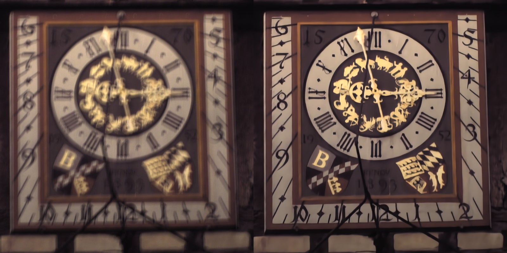
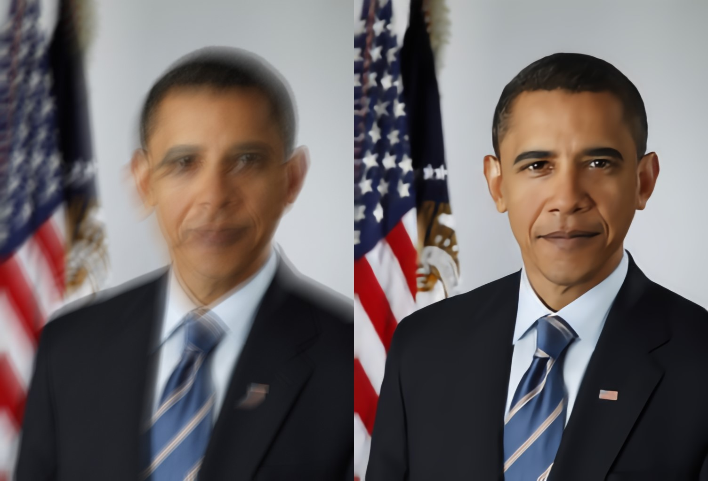
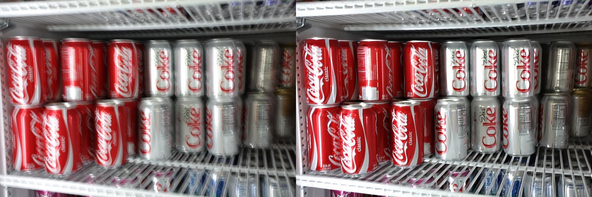

# Deblurring using Analysis-Synthesis Networks Pair (CVPR 2020)

Adam Kaufman, [Raanan Fattal](https://www.cs.huji.ac.il/~raananf/) (Official implementation)

**Paper:** https://arxiv.org/abs/2004.02956

**Project page:** https://www.cs.huji.ac.il/~raananf/projects/deblurnets/

## Abstract

Blind image deblurring remains a challenging problem for modern artificial neural networks. Unlike other image restoration problems, deblurring networks fail behind the performance of existing deblurring algorithms in case of uniform and 3D blur models. This follows from the diverse and profound effect that the unknown blur-kernel has on the deblurring operator.

We propose a new architecture which breaks the deblurring network into an analysis network which estimates the blur, and a synthesis network that uses this kernel to deblur the image. Unlike existing deblurring networks, this design allows us to explicitly incorporate the blur-kernel in the network’s training.

In addition, we introduce new cross-correlation layers that allow better blur estimations, as well as unique components that allow the estimate blur to control the action of the synthesis deblurring action. Evaluating the new approach over established benchmark datasets shows its ability to achieve state-of-the-art deblurring accuracy on various tests, as well as offer a major speedup in runtime.

## Deblurring examples

see the paper, project page and results section for more deblurring results

## Usage example:
To deblur the image in directory `blurry_images_dir_path` and save the results to `results_dir_path`
    
    python deblur_main.py -i blurry_images_dir_path -o results_dir_path
    
To deblur a single image `blurry_image_path` and save the results to `results_dir_path`

    python deblur_main.py -i blurry_image_path -o results_dir_path    

To recreate the results from [Deblurring Examples](#deblurring-examples) above: 

    python deblur_main.py -i ./blurry_input -o ./results -sbs

## Usage:

    usage: deblur_main.py [-h] --input_path INPUT_PATH [--out_dir OUT_DIR]
                      [--suffix SUFFIX]
                      [--analysis_weights_path ANALYSIS_WEIGHTS_PATH]
                      [--synthesis_weights_path SYNTHESIS_WEIGHTS_PATH]
                      [--analysis_max_input_size ANALYSIS_MAX_INPUT_SIZE [ANALYSIS_MAX_INPUT_SIZE ...]]
                      [--plot] [--side_by_side]

    optional arguments:
    
      -h, --help            show this help message and exit
      --input_path INPUT_PATH, -i INPUT_PATH
                            A path to a single image to deblur or a path to a directory to deblur (in this case, all images in the given directory will be
                            deblurred). (default: None)
      --out_dir OUT_DIR, -o OUT_DIR
                            Where to save the deblurred results. (default: results)
      --suffix SUFFIX, -s SUFFIX
                            A suffix to add to the result image (before the image extension) (default: _deblurred)
      --analysis_weights_path ANALYSIS_WEIGHTS_PATH, -amp ANALYSIS_WEIGHTS_PATH
                            Path to the analysis model weights. The weights will be automatically downloaded if the path doesn't exists (default:
                            models\analysis_weights.h5)
      --synthesis_weights_path SYNTHESIS_WEIGHTS_PATH, -smp SYNTHESIS_WEIGHTS_PATH
                            Path to the synthesis model weights. The weights will be automatically downloaded if the path doesn't exists (default:
                            models\synthesis_weights.h5)
      --analysis_max_input_size ANALYSIS_MAX_INPUT_SIZE [ANALYSIS_MAX_INPUT_SIZE ...], -amis ANALYSIS_MAX_INPUT_SIZE [ANALYSIS_MAX_INPUT_SIZE ...]
                            The maximal input size to use when estimating the kernel. In case the size it is smaller than the input resolution, a window with the
                            specified size is cropped around the center and used for the kernel prediction (this would be fine as long as the window is big enough
                            to statistically represent the image&blur, but in general it will hurt the deblurring accuracy) This is useful in case we don't have
                            enough memory in the GPU and are getting OOME (out of memory exception).In such cases, specify this argument (try -amis 512 at first
                            (or even something larger) and then move to smaller sizes if the error still occurs) (default: None)
      --plot, -p            Should the results also be plotted or just saved (default: False)
      --side_by_side, -sbs  Should the result image include both the input the deblurred image (i.e. the saved image would be the blurry and deblurred images side
                            by side) (default: False)

## Environment 
To create a virtual environment with the required packages to run the code do the following:

1.  Create a virtual environment named "deblurring-env" (in the current working directory):

        python3 -m venv deblurring-env
        
2. Activate the virtual environment:
    * On windows:
        
            deblurring-env\Scripts\activate.bat        
    * On linux/MacOS
    
            source deblurring-env/bin/activate
      (If you use the csh or fish shells, there are alternate activate.csh and activate.fish scripts you should use instead.)
    
3. Install the requirements

        python -m pip install -r requirements.txt
        
   switch `requirements.txt` with `requirements_tf_1.15.0.txt` or `requirements_tf_2.3.0.txt`:
   
    * `requirements_tf_1.5.0.txt` - install an environment with tensorflow 1.15.0 which works with CUDA 10.0 and cuDNN 7.4
    * `requirements_tf_1.5.0.txt` - install an environment with tensorflow 2.3.0 which works with CUDA 10.1 and cuDNN 7.6
    
Note that the above won't install any cuda environment and they need to be installed separately

## Results
The deblurred results of our network for the datasets reported in the paper can be downloaded from the following links:
* [Köhler dataset](https://drive.google.com/open?id=1SoYP8fwGRaxcP6f-CXo2U9-0-By331cB)
* [Lai synthetic dataset](https://drive.google.com/open?id=1z9oPUuwDseV34XqzB2rjO_Kj9MPnQFqH)
* [Lai real](https://drive.google.com/open?id=1LjVxPrnBYSruE0PAFJ7FYUpHL-1EoMby)

## Notes:
* In case of OOEM (out of memory error), see `analysis_max_input_size` argument in the usage section
* This repository only contains the "vanilla" prediction code for now, i.e. it doesn't use the *Scale Optimized Networks* (see the paper for more details)
* The kernel generation code will be added soon
* The *Scale Optimized Networks* and training code will be hopefully be added as well
* In case your are interested to compare your work to this work on a new dataset, please send us the blurry images so we can deblur them using the *Scale Optimized Networks* (until the relevant code is added here)

## BibTeX
    @article {Kaufman20,
    author = {Kaufman, Adam, and Fattal, Raanan},
    title = {Deblurring using Analysis-Synthesis Networks Pair},
    journal = {Computer Vision and Pattern Recognition (CVPR)}},
    year = {2020},
    volume = {38},
    number = {2},
    }

